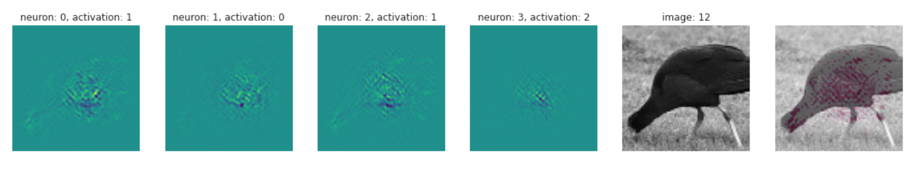

```english
---
layout: post
title:  "Does saliency play a role in V4 neurons of monkeys?"
date:   2021-02-11
description: "Investigating V4 neurons and visualizing to what patterns they react most"
tags: [V4, saliency, neural prediction, gradient receptive fields, kPCA]
comments: false
share: true
authors: Katharina Anderer
typora-copy-images-to: ../media/katharina/
typora-root-url: ../
---
```

# Summary

It is proposed e.g. in [1] that the visual area V4 has an important role in selective attentional processes, that is the enhanced processing of certain stimuli. These selective processes are important to guide our attention to stimuli that are most important for surviving or dealing with everyday tasks. Stimuli that catch our attention most and also fastest are called **salient stimuli.** 

In my lab rotation, I used so called **saliency maps** that are created by DeepGaze, a deep neural network [2] and tried to explore with them whether or not saliency plays a role in V4. The DeepGaze algorithm is trained with eye-tracking data on fixation points and is then able to create saliency maps for new images. These saliency maps should show where in the picture salient points most probably lay. 

In order to investigate if saliency might play a role in V4 neurons, I tried the following different approaches:


<u>Part 1:</u>

* Feeding in the saliency maps as an additional channel to a CNN network (trying different readouts and variations here).
* Writing a new readout (**SaliencyShifter readout)** that takes the images through the core and the saliency maps to a remapper network that calculates possible shifts of each neuron individually. I will go into more detail below and also direct to the permalinks of the code.

<u>Part 2:</u>

* The last approach was more about visualizing to what features in the input image neurons in V4 reacted most. The idea behind this was to see if RFs of the neurons where shifting towards salient objects. Some results indicate that the RFs might be larger than expected and neurons seem to react to shapes and textures. Further, there are some indications that the gradient receptive fields seem to extend their usual area towards objects in an image. 
* notebooks: [analysis_of_RF_V4.ipynb](media/katharina/notebooks/monkey_project/analysis_of_RF_V4.ipynb), [PCA_RF_images.ipynb](media/katharina/notebooks/monkey_project/PCA_RF_images.ipynb)

# Part 1: Saliency maps as inputs to CNN network

The background for this approach is the prediction of activation patterns of neurons in V4 neurons during visual processing. CNNs are so far the best architectures for doing that. The idea was now to use an existing CNN network, but adding saliency maps as an additional channel.  The V4 area is already an intermediate processing layer in the hierarchy of visual processing and in [1] it is proposed that V4 is involved in feature extraction and attentional processes. 

### How to calculate saliency maps?

In order to derive the information of which parts in an image are probably the most salient ones, we could make use of the package Deep Gaze, written by Matthias Kümmerer, Lucas Theis and Matthias Bethge (2014). Deep Gaze uses a pretrained network to generate a high-dimensional feature space and then combines this network with the data on fixations of the MIT-1003 (a dataset for training and testing saliency in humans). 

You can refer to this notebook for calculating the saliency maps: [link to notebook for calculating saliency maps](media/katharina/notebooks/monkey_project/loading_monkey_experiment_images_to_folder.ipynb)

### Difficulties and possible error sources with saliency maps

* Input size of the network seems to matter. It is trained for 35 pixel per degree of visual angle
* It can make a large difference if we zoom in the picture and then calculate the saliency maps or the other way round. So this should be always be kept in mind when for example cropping is applied to the images.
* A center bias is added to the network in order to account for the tendency to focus more on the center of an image.  Whether or not a center bias is appropriate is probably a question of the context. The algorithm of DeepGaze is constructed such that it can predict the areas of highest gaze density with high accuracy. In our case tough, it is not so obvious if a center bias is contributing to the task to give the network information about salient points in an image.
* The DeepGaze algorithm blurs the salient density points - it's a trade-off of loosing information or missing neighborhood parts of interest and to make the area of attention a bit 'softer'. 


### Further extension with spatial gradients

In order to give the network also the information in which direction the salient point are, we computed the spatial gradients with regard to the x- and y- axis. For this, we first applied a Gaussian filter and then the Sobel gradients with respect to x and y separately. 

The data loader, which we named **saliency loader**, is adapted from the monkey static loader and takes several arguments (e.g. whether the gradients and/or the saliency maps should be included). For more information on how I implemented this, you can refer to this permalink:

https://github.com/andererka/nnsaliency/blob/589fc29ec421522f1901c0ade4fbdbf7a345fb29/nnsaliency/datasets/saliency_loaders.py#L25

Here is an example of how saliency maps and gradients could look like:


### Testing different CNN architectures and readouts

I tested this approach with the following architectures/ readouts:

* CNN with a Gaussian readout (nnvision.models.se_core_full_gauss_readout)

* CNN with a multiple attention 2D readout: https://github.com/fabiansinz/neuralpredictors/blob/b510273fa3302db06549dfa943b3c03b46008884/neuralpredictors/layers/readouts.py#L1677

* untrained ResNet (ptrmodels.task_core_gauss_readout)

* **Saliency Shifter Model:** The images are put through the core and the saliency maps and the gradients are used to compute the neuron specific shift. At the end, the core and the neuron specific shift are used for the final feature map readout (Multi Gaussian). For more information, you can refer to these permalinks of the code:

  https://github.com/andererka/nnvision/blob/e3046e4227fc7207f44d1ff106d90a1f3f008067/nnvision/models/readouts.py#L215 (readouts.py), 

  https://github.com/andererka/nnvision/blob/e3046e4227fc7207f44d1ff106d90a1f3f008067/nnvision/models/readouts.py#L314 (readouts.py),

  https://github.com/andererka/nnvision/blob/e3046e4227fc7207f44d1ff106d90a1f3f008067/nnvision/models/models.py#L130 (models.py)

  Here is a schema figure of this:


### Results of first approach

#### Training curves

The plot to the left is showing training curves (validation correlation is plotted on the y-axis) for CNN and ResNet architectures that get only the images as input. The plot to the right shows the training curves where additionally the saliency maps are fed into the networks. From eye-balling, one cannot see differences between the training curves of the models with only images and the models with images and saliency maps. There is only the difference that the ResNet architecture seems to learn a lot faster and stops earlier (after around 30 epochs compared to ~70 epochs for the CNN with Gaussian readout). 


A similar comparison was done for the Saliency Shifter model :

The plot below shows a comparison of three different inputs for the remapping part:

1. Orange: Tensor of ones was given to the remapper in order to see how the model is behaving when no information goes into the remapper.
2. Blue: Saliency and gradients were given to the remapper
3. Green: Only images were given to the remapper (channel is copied, so that we always have three channels for the remapper input). 

The last model is performing the best (both with respect to validation error and testing error). It seems that the model with only the image is so far the most informative for calculating shifts


#### Validation and test correlations

Using a larger input area of the image, and therefore a smaller cropping on each side of the image, was almost always leading to an increase in performance, indicating that the receptive fields of the neurons were quite large or what could also be true, that the receptive fields were shifted sometimes. 

When I compared the same cropping sizes, the validation correlations and test correlations of the three different scenarios - Only Images, Images + Saliency, All (Images + Saliency + Gradients) - were quite similar, so that we could not conclude that the saliency maps were contributing any information for the prediction of neural activation. 


The same was the case for the models with an attention core:


# Part 2: Visualization of what neurons find interesting

I took several approaches to find out what neurons in V4 in macaque monkeys find most interesting. 

* example-based visualization where I looked at the images that were leading to the strongest activation in neurons and then plotted them. This approach revealed that one neuron was strongly firing when animal prints were shown, while another neuron was firing strongly when images with dark light or fur were shown. 

* image-specific visualization of gradient receptive fields: The paper of Simonyan, Vedaldi & Zisserman (2013) gave the idea to calculate the image-specific gradient receptive fields of a neuron in order to visualize what pixels have to change in order to change the activation of the neuron. 

* calculating a PCA, including 500 different RFs, and visualizing how the components contribute to the receptive fields. A PCA was always calculated individually per neuron. 

* projecting the images into the RFs eigenspace, using a kernel PCA for this purpose. The aim here was to see which parts of an image are projected out because they have low variance and are therefore not relevant to the neurons activation. 

  
  
  You can refer to this notebook for further details: [analysis_of_RF_V4.ipynb](media/katharina/notebooks/monkey_project/analysis_of_RF_V4.ipynb)
  
  

### Example-based visualization


Here I looked at the three neurons with the best overall test correlation and plotted, for each neuron separately, the 200 images that were leading to the strongest activation.

<u>Result for neuron with the best test correlation:</u>

The neuron seems to be 'interested' in fur, hair, dark light intensity pictures. Further, some wire fence patterns occur in several images. 


<u>Result for neuron with second best test correlation</u>:

There are several images with animal prints, dots or other ornament patterns. The images seem to be lighter on average compared to the images of the first neuron. 


Overall, this approach gives a first intuition on what might be processed in V4. Features that are shared across the most activating images are maybe the features that are 'generated' by V4. So maybe it might be the case that neurons in V4 have the role of integrating lines, dots, curves and so on to an animal print or a text sign (among possible other roles).

The approach, nevertheless, is very subjective and even that we are seeing some similarity between the images, we cannot tell what is represented within the layer of V4 and how. 


### Image-specific visualization of gradient receptive fields

With the next approach, I was hoping to find out more precisely what in an image is affecting the activation of a neuron. The idea arose when I was reading [3] where they calculated an image-specific gradient visualization that they called 'saliency maps'. Tough far apart from what I originally expected the paper to be about (as I was thinking about the saliency maps that DeepGaze was producing), the paper was exploring the idea that the pixels in an image that most affect the activation of a neuron can be visualized. To elaborate on this, the idea is that through gradient descent, we can figure out which pixels have to change least in order to have the biggest effect on changing the activation of the neuron. In the paper [3], they didn't do this with respect to the activation of the neuron, but with respect to the classification score of an object. 


Here is a scratch of the approach in order to get an intuition:


#### First look into gradient receptive fields for 4 different neurons

Below you can see some examples that indicate some shifts of the gradient receptive fields. If e.g. an object's head (image: 12) is outside the usual area of the RF, some gradient receptive fields seem to extend their usual area of interest. The last column takes the pixels of highest activation from all the 4 neurons and plots them on top of the images. It is an attempt to visualize that the pixels of most interest for a neuron seem to be along edges of an object.  





Some other examples also indicated that the neurons are interested in curves, textures and object borders:

Here are some other examples if you are interested:   


### Highlighting differences between high and low values in gradient receptive fields


The gradient receptive fields can be also plotted with a divergent color-map such that we better see the differences between very high and very low values. Below, blue is corresponding to low values and red is corresponding to high values. 

Here are some of the most impressive gradient receptive fields:


Here are some more examples:

  

Before, when we looked at the example-based visualization, we saw that the neuron with the best test correlation was firing most strongly to completely different images compared to the neuron with the second best test correlation, even that they were seeing the exact same images (both neurons belong to the same session id). 

Now, I want to highlight these different 'interests' as I compared their image-dependent gradient receptive fields. Further, I checked if there are differences in the gradient receptive fields for the images that were leading to the strongest activation, compared to the images that were leading to no or just a weak activation.

Here are some examples that were leading to the **strongest activation** for the <u>neuron with the best test correlation:</u>


Here the same for the <u>neuron with the second best test correlation</u>:


Plotting now some examples that were leading to the **weakest activation** for these two neurons, one might notice, that these gradient receptive fields seem much less structured as the ones above:


<u>Neuron with best test correlation:</u>


<u>Neuron with second best test correlation:</u>


We also got some evidence that the values of the gradient receptive fields have quite a different distribution for the 200 images that were leading to the strongest activation, compared to the 200 images that were leading to the weakest.


<u>Distribution of values for neuron with best test correlation:</u>


The distribution for the worst images seems to have a strong peak around zero, while the distribution for the best images is much broader. 

#### Digging deeper into it with a principal component analysis

To further dig into this, the idea was to apply a principal component analysis onto the gradient receptive fields to get rid of some noise and also get an intuition of how the gradient receptive fields were build up. We can also learn about the percentage of variance explained by the different components and look into how complex the behavior of a cell is. 


For the 10 neurons with the best test correlation, the following plots show the eigenvalues and the percentage of explained variance with increasing number of PCs:


For implementation details, you can refer to this notebook: [kPCA_notebook.ipynb](media/katharina/notebooks/monkey_project/kPCA_notebook.ipynb)


### Projecting the images into the eigenspace of the gradient receptive fields

One of the last things that I tried during my lab rotation was a kPCA in order to project the images into the eigenspace of the gradient receptive fields. The idea behind this was to see if the parts of the image that were not relevant to the neuron (with respect to the gRF) were simply projected out. The parts of the image with the highest variance should instead reflect which parts are relevant to the neuron and these parts should also be reconstructed quite well.

For implementation details, you can refer to the following notebook: [analysis_of_RF_V4.ipynb](media/katharina/notebooks/monkey_project/analysis_of_RF_V4.ipynb)

What was a quite interesting finding to me was that the region of interest seems to grow as I include more gradient receptive fields into the kPCA. So the locality of the gradient receptive fields seems to get looser if we include more gRFs. 

Speculating about this finding, this could indicate that the gRFs shift for some images and therefore the projected region gets wider as we include more and more gRFs.

Here is one example for the projection - the first plot is a projection with 500 gRFs and the second one shows examples for a projection with 2000 gRFs.

<u>Projection with 500 gRFs</u>:


<u>Projection with 2000 gRFs:</u>


For more examples see here:

[Examples Projection of images with gRFs PCs: based on 500 gRFs](media/katharina/projection_of_images_with_PCs_of_RFs_500.png)

[Examples Projection of images with gRFs PCs: based on 1000 gRFs](media/katharina/projection_of_images_with_PCs_of_RFs_1000.png)

[Examples Projection of images with gRFs PCs: based on 2000 gRFs](media/katharina/projection_of_images_with_PCs_of_RFs_2000.png)

# Discussion


Although we could not find an improvement to neural prediction through the use of saliency maps, this does not answer the question if saliency plays a role in V4 or not. There are several possible reasons why the network might have failed to process the information of saliency. Given that the images explain much more variance, the network might have set the weights for the saliency maps to a very small number and only learned to predict neural activation with the information of the images. Another approach to this could be to first train the network with only the images and then train the network on the saliency maps. It might also be possible to stack the saliency maps into the network at an already advanced, intermediate layer of the network.

In my opinion, it is also possible that the network is already learning some form of saliency just by the images themselves, for example by detecting certain objects and learning that these are important for the neuron. 

Another reason why the saliency information brought no gain could be that the saliency prediction was not adequate for monkeys, as the DeepGaze model is only trained with human data. The image data set included lots of **text signs** that might be very salient for humans, but not for monkeys. If there is a human/monkey bias could be verified by an eye-tracking experiment with monkeys. 


The results evoke the question if **receptive fields in V4 shift and change** depending on where interesting stimuli lay. Showing that the gradient receptive fields of the model's neuron change and shift depending on the input image is not enough evidence to conclude this. We do not know if the model representation is similar to what the neurons are representing. It is also possible that the model is learning neural prediction on only some very basic level or that it is biased in some way that is not reflecting the real neurons behavior. 

In order to check if the real neuron would also show image-dependent shifts or similar gradient receptive fields compared to the model, one needs to design further experiments. 

Especially for the question if saliency is an important concept for V4 neurons, one needs to compare network architectures that are capable of detecting salient objects to ones that aren't. Maybe this can be approached with the help of saliency maps if more suitable network architectures can be found. Perhaps it is enough to compare network architectures that are capable of shifts towards salient objects without the need of saliency maps. 


Another approach could also be to refine our concept of saliency for neurons in V4. As we saw, different neurons in V4 seem to be interested in different things. While certain textures seem to be very salient to some neurons, certain objects might be salient to others. Maybe it is possible to find certain clusters of neurons and to classify what their **concept of saliency** is.


# References

[1] Roe, A. W., Chelazzi, L., Connor, C. E., Conway, B. R., Fujita, I.,  Gallant, J. L., ... & Vanduffel, W. (2012). Toward a unified theory  of visual area V4. *Neuron*, *74*(1), 12-29.

[2] Kümmerer, M., Theis, L., & Bethge, M. (2014). Deep gaze i: Boosting saliency prediction with feature maps trained on imagenet. arXiv preprint arXiv:1411.1045.

[3] Simonyan, K., Vedaldi, A., &  Zisserman, A. (2013). Deep inside convolutional networks: Visualising  image classification models and saliency maps. *arXiv preprint arXiv:1312.6034*.

